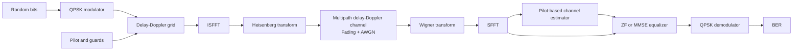

# POWDER-OTFS

POWDER-OTFS is a Python research framework for simulating an Orthogonal Time
Frequency Space (OTFS) communication link. The long-term goal is to reuse the
validated signal-processing modules for over-the-air experiments on the
[POWDER testbed](https://powderwireless.net/) with USRP B210 and X310 radios.

## Current features

- QPSK modulation and demodulation
- Configurable delay-Doppler grid
- Embedded pilot and guard region
- ISFFT, SFFT, Heisenberg, and Wigner transforms
- Multipath delay-Doppler channel with AWGN
- Fixed, Rayleigh, and Rician fading
- Perfect-CSI and embedded-pilot channel estimation
- Zero-Forcing and MMSE equalization
- Multi-frame BER calculation
- Delay-Doppler and constellation debugging plots
- Automated tests

## System model



## Quick start

From the project root:

```bash
python3 -m venv .venv
source .venv/bin/activate
python -m pip install -e .
python -m pip install pytest
python -m pytest
python examples/end_to_end.py
```

Select between one and ten predefined channel paths:

```bash
python examples/end_to_end.py --num-paths 5
```

## Documentation

- [OTFS fundamentals](docs/otfs-theory.md): why OTFS is useful, how it differs
  from OFDM, and how the transmitter and receiver work.
- [Simulation guide](docs/simulation-guide.md): installation, parameters,
  running experiments, interpreting output, and debugging.
- [POWDER OTA guide](docs/ota-guide.md): workbench startup, pilot-bearing X310
  transmission, IQ capture, channel estimation, equalization, and offline
  plotting.

## Current limitations

The current implementation is SISO and supports QPSK, integer-sample delays,
and grid-aligned Doppler estimation. The offline X310 link uses a time-domain
preamble for frame synchronization and CFO correction, a cyclic prefix, an
embedded DD pilot, pilot-based channel estimation, and ZF or MMSE equalization.
It does not yet include fractional delay/Doppler estimation, FEC, or
standardized channel profiles.

## Roadmap

1. Complete and validate the SISO simulation.
2. Add fractional delay/Doppler and standardized channel profiles.
3. Add an OFDM baseline and OTFS-versus-OFDM comparisons.
4. Add offline B210 and X310 waveform experiments on POWDER.
5. Add synchronization and real-time processing.
6. Extend to outdoor and vehicle experiments.
