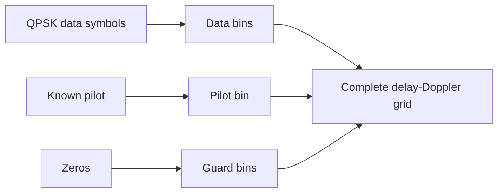
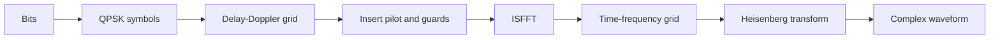
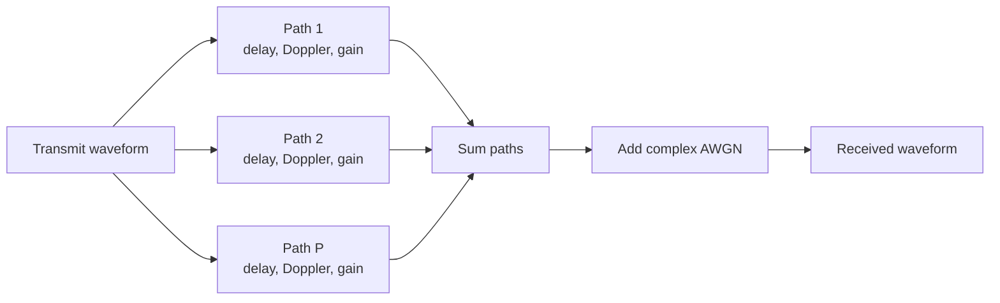
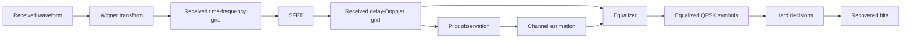
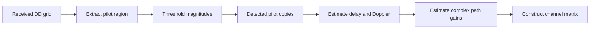

# OTFS Fundamentals

This document introduces the motivation and signal-processing flow behind
Orthogonal Time Frequency Space (OTFS). It describes the model implemented in
POWDER-OTFS. Detailed mathematical derivations and measured comparisons with
OFDM will be added as the project develops.

## Why another waveform when OFDM already exists?

Orthogonal Frequency Division Multiplexing (OFDM) sends data over many
orthogonal subcarriers. It is widely used because frequency-selective channels
can be equalized efficiently when the channel changes slowly during each OFDM
symbol.

High mobility creates Doppler shifts and time variation. These effects can
break subcarrier orthogonality, create inter-carrier interference, and make the
channel vary rapidly across time and frequency.

OTFS places information symbols in the delay-Doppler domain instead of directly
in the time-frequency domain. Delay represents propagation time, while Doppler
represents frequency shift caused by motion. A sparse physical channel can
therefore appear as a small collection of delay-Doppler paths.

OTFS does not eliminate the channel. Its purpose is to represent and process a
time-varying channel in a domain that is closely related to the channel's
physical delay and motion.

## OFDM and OTFS at a high level

```mermaid
flowchart TB
    subgraph OFDM["OFDM"]
        O1["QAM symbols"] --> O2["Time-frequency resource grid"]
        O2 --> O3["OFDM modulation"]
        O3 --> O4["Time-varying channel"]
        O4 --> O5["OFDM demodulation and equalization"]
    end

    subgraph OTFS["OTFS"]
        T1["QAM symbols"] --> T2["Delay-Doppler grid"]
        T2 --> T3["2-D OTFS transform"]
        T3 --> T4["Time-frequency grid"]
        T4 --> T5["Waveform modulation"]
        T5 --> T6["Time-varying channel"]
        T6 --> T7["Waveform demodulation"]
        T7 --> T8["Inverse 2-D OTFS transform"]
        T8 --> T9["Delay-Doppler estimation and detection"]
    end
```



The planned OFDM baseline will use the same modulation, bandwidth, channel, and
BER measurement settings wherever possible. That will allow meaningful
OTFS-versus-OFDM comparisons rather than comparisons between unrelated
configurations.

## Delay-Doppler grid

The OTFS data grid is represented by:

```text
X_DD ∈ C^(M × N)
```

where:

- `M` is the number of delay bins;
- `N` is the number of Doppler bins;
- each data bin contains one complex QPSK symbol in the current implementation.

The example also reserves one bin for a known pilot and zeros a rectangular
guard region around it.



## OTFS transmitter

The transmitter converts the delay-Doppler grid into time-domain complex
samples.



The project uses unitary FFT normalization (`norm="ortho"`) throughout.

### ISFFT

The inverse symplectic finite Fourier transform maps the delay-Doppler grid to
the time-frequency grid. In the current convention, the implementation applies:

1. an inverse FFT along the delay axis;
2. an FFT along the Doppler axis.

Using one explicit convention consistently is essential because OTFS papers and
implementations may use different axis orders and FFT signs.

### Heisenberg transform

The Heisenberg stage converts each time-frequency column into time-domain
samples using an inverse FFT along the subcarrier axis. The columns are then
serialized in Fortran order so the samples of each time slot remain
consecutive.

## Channel model

The simulated received waveform is the sum of multiple propagation paths:

```text
r(t) = Σ h_p s(t - τ_p) exp(j 2π ν_p t) + w(t)
```

For path `p`:

- `h_p` is its complex gain;
- `τ_p` is its delay;
- `ν_p` is its Doppler shift;
- `w(t)` is complex AWGN.



The current channel uses circular integer-sample delays. This keeps the frame
length fixed and represents an effective cyclic-prefix-protected,
timing-aligned observation. Explicit cyclic-prefix insertion and removal are
not implemented yet.

The current pilot estimator supports Doppler shifts located exactly on Doppler
bins:

```text
Δν = sample_rate / (M N)
ν_p = k_p Δν
```

Fractional Doppler will spread energy across multiple bins and requires a more
advanced estimator and detector.

## Fading models

The base complex gain of each path can be used directly or multiplied by a
random fading coefficient:

- **Fixed:** no random fading multiplier.
- **Rayleigh:** complex zero-mean Gaussian fading, suitable when no dominant
  line-of-sight component is modeled.
- **Rician:** a deterministic line-of-sight component plus a scattered random
  component controlled by the Rician K-factor.

The example generates a new fading realization per frame for Rayleigh and
Rician operation.

## OTFS receiver



The Wigner transform reverses the waveform modulation. The SFFT then returns
the received signal to the delay-Doppler domain using the inverse operations of
the transmitter convention.

## Embedded-pilot channel estimation

A path shifts and scales the known pilot. The receiver searches the configured
pilot-observation region for bins above a noise-dependent threshold.



The example uses:

```text
threshold = threshold_factor × sqrt(noise_variance)
```

A threshold that is too low can classify noise as paths. A threshold that is
too high can miss weak paths.

The estimator reconstructs the complete channel matrix by passing every
delay-Doppler basis vector through the estimated paths. This is clear and
useful for validation, but computationally expensive for larger grids.

## Equalization

The received delay-Doppler grid is flattened into:

```text
y = Hx + n
```

where `H` is the estimated channel matrix.

### Zero Forcing

The ZF equalizer solves a least-squares problem:

```text
x_hat = arg min ||Hx - y||²
```

ZF can strongly amplify noise when `H` is poorly conditioned.

### MMSE

The linear MMSE equalizer uses:

```text
x_hat = (HᴴH + (σ²/E_s)I)^(-1) Hᴴy
```

The regularization term uses the channel noise variance `σ²` and assumed symbol
energy `E_s`. This generally makes MMSE more stable than ZF in noisy or
ill-conditioned channels.

## Planned OFDM comparison

The OFDM comparison is not implemented yet. When added, it should report at
least:

- BER versus SNR;
- BER versus Doppler or vehicle speed;
- channel-estimation error;
- computational cost;
- spectral efficiency after pilot and guard overhead.

Plots must use the same random data, modulation order, channel realization,
frame count, and power normalization for both waveforms.
