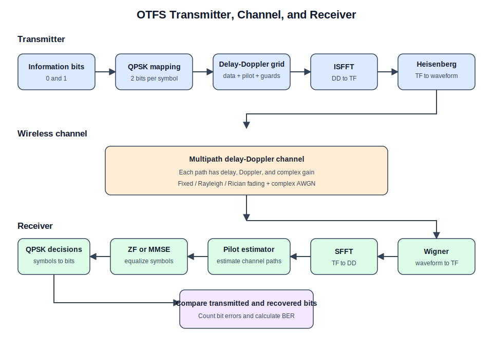
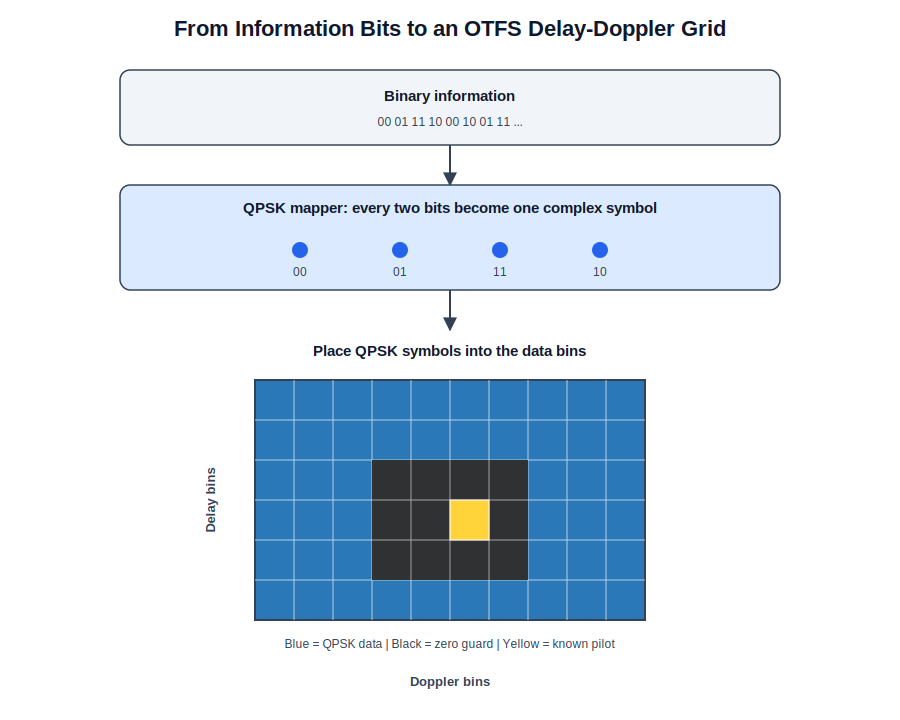

# OTFS Fundamentals

This document gives a simple introduction to Orthogonal Time Frequency Space
(OTFS) and explains the signal flow used in POWDER-OTFS.

## Why OTFS when OFDM already exists?

OFDM sends QAM symbols on many subcarriers. It works very well when the wireless
channel changes slowly.

When a transmitter or receiver moves quickly, the received signal experiences
Doppler shifts. The channel can then change during an OFDM symbol, causing
inter-carrier interference and making channel estimation more difficult.

OTFS handles the data differently:

- OFDM places data directly in the **time-frequency domain**.
- OTFS first places data in the **delay-Doppler domain**.

Delay represents how late a reflected signal arrives. Doppler represents the
frequency shift caused by motion. These quantities describe the physical paths
between the transmitter and receiver.

OTFS still produces a time-domain waveform for transmission. The
delay-Doppler grid is an additional signal-processing layer that makes a
time-varying multipath channel easier to represent and estimate.

## Complete OTFS link

The diagram is arranged over several rows so every processing block remains
readable at normal page width.



## Step 1: Bits become QPSK symbols

The transmitter begins with binary information:

```text
00  01  11  10
```

QPSK maps every two bits to one complex symbol:

```text
00 -> (+1 + j) / sqrt(2)
01 -> (+1 - j) / sqrt(2)
11 -> (-1 - j) / sqrt(2)
10 -> (-1 + j) / sqrt(2)
```

The real part is the in-phase component and the imaginary part is the
quadrature component. The division by `sqrt(2)` gives the constellation unit
average power.

## Step 2: QPSK symbols fill the delay-Doppler grid

The QPSK symbols are placed into a two-dimensional array:

```text
X_DD has shape M x N
```

- `M` is the number of delay bins.
- `N` is the number of Doppler bins.
- Most bins contain QPSK data.
- One bin contains a known pilot.
- Bins around the pilot are set to zero and form the guard region.

The pilot is stronger than a normal data symbol. After the channel shifts and
scales it, the receiver uses the resulting pilot copies to estimate the channel
paths.



## Step 3: Delay-Doppler becomes time-frequency

The delay-Doppler grid is not transmitted directly. The ISFFT converts it into
a time-frequency grid.

In this project, the ISFFT applies:

1. an inverse FFT along the delay axis;
2. an FFT along the Doppler axis.

The result has the same `M x N` shape, but its meaning has changed:

- each row represents a subcarrier;
- each column represents a time slot.

Every delay-Doppler symbol contributes to multiple time-frequency samples. This
spreads each information symbol across the frame instead of assigning it to
only one time-frequency location.

## Step 4: Time-frequency becomes a waveform

The Heisenberg transform applies an inverse FFT across the subcarriers of every
time slot. This produces time-domain samples.

The columns are then placed one after another:

```text
time slot 0 samples
time slot 1 samples
...
time slot N-1 samples
```

The result is one complex waveform containing `M x N` samples. This waveform is
what the simulated channel receives and what a future USRP transmitter will
send.

## Step 5: The wireless channel changes the waveform

A received signal normally contains several copies of the transmitted
waveform. Each propagation path can have:

- a different delay;
- a different Doppler shift;
- a different complex gain.

The channel adds all path contributions and then adds complex AWGN:

```text
r(t) = sum of delayed, Doppler-shifted, scaled copies of s(t) + noise
```

The current model uses circular integer-sample delays. This keeps the frame
length fixed and represents a cyclic-prefix-protected, timing-aligned frame.
Explicit cyclic-prefix insertion and removal are not implemented yet.

### Fading

The path gains can use one of three models:

- **Fixed:** the configured complex gain does not change.
- **Rayleigh:** the gain changes randomly with no dominant line-of-sight path.
- **Rician:** a line-of-sight component is combined with random scattering.

For Rayleigh and Rician fading, the example generates new gains for every
frame.

## Step 6: The receiver returns to the delay-Doppler domain

The receiver reverses the transmitter transforms:

1. The **Wigner transform** converts the received waveform into a received
   time-frequency grid.
2. The **SFFT** converts the time-frequency grid into a received
   delay-Doppler grid.

The received grid is not yet the transmitted grid. It contains shifted and
scaled contributions from the channel paths, plus noise.

## Step 7: The pilot estimates the channel

The receiver looks only inside the configured pilot-observation region.
Channel paths create shifted copies of the known pilot.

For every detected pilot copy, the estimator obtains:

- delay from its vertical displacement;
- Doppler from its horizontal displacement;
- complex gain from its value relative to the known pilot.

Only pilot responses above this threshold are accepted:

```text
threshold = threshold_factor * sqrt(noise_variance)
```

A low threshold can detect noise as false paths. A high threshold can miss weak
paths.

The current estimator assumes integer delay and grid-aligned Doppler:

```text
Doppler resolution = sample_rate / (M * N)
Doppler shift = Doppler bin * Doppler resolution
```

Fractional delay and fractional Doppler require a more advanced estimator.

## Step 8: Equalization removes the estimated channel

After channel estimation, the receiver uses:

```text
y = Hx + n
```

- `x` is the transmitted delay-Doppler symbol vector.
- `H` is the estimated channel matrix.
- `y` is the received vector.
- `n` is noise.

The project provides two equalizers:

- **Zero Forcing (ZF):** finds the least-squares solution. It can amplify noise
  when the channel matrix is poorly conditioned.
- **MMSE:** includes the estimated noise variance and is generally more stable
  for noisy multipath channels.

The equalized symbols should cluster around the four QPSK constellation points.
The QPSK demodulator then converts their signs back into bits.

## Step 9: BER measures the recovered data

The bit error rate is:

```text
BER = incorrect recovered bits / total transmitted data bits
```

The pilot and guard bins are excluded because they do not carry user data.
The example accumulates errors over multiple OTFS frames.

Zero BER at high SNR is possible for the current grid-aligned simulation. It
does not guarantee zero BER with fractional Doppler, synchronization errors, or
real OTA hardware.

## OTFS and OFDM comparison

An OFDM baseline has not been implemented yet. A fair future comparison should
use the same:

- QAM order;
- bandwidth and sample rate;
- transmitted information bits;
- channel paths and noise realization;
- pilot overhead;
- number of frames.

The comparison should include BER versus SNR, BER versus Doppler or vehicle
speed, channel-estimation error, computational cost, and spectral efficiency.
